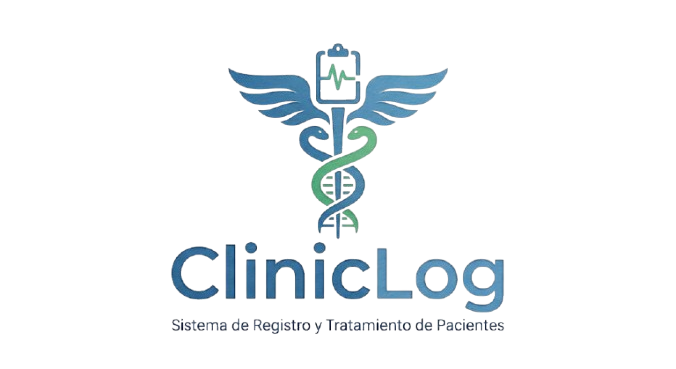

<p align="center">
  
</p>

<h1 align="center">ClinicLog</h1>

<p align="center">
  Sistema de registro y seguimiento de pacientes y tratamientos
</p>

---

## Descripción

ClinicLog es un sistema de consola que permite registrar pacientes, asociar tratamientos y llevar un seguimiento básico mediante observaciones de tomas, visitas o controles.

El proyecto busca organizar la información de pacientes y tratamientos en un solo lugar, facilitando su consulta y seguimiento.

## Funcionalidades

1. Registrar pacientes.
2. Registrar tratamientos asociados a un paciente.
3. Ver pacientes y tratamientos registrados.
4. Consultar y registrar seguimiento de pacientes.
5. Salir del sistema.

## Validaciones

- Nombres y apellidos: solo letras y espacios.
- Edad: entre 0 y 120 años.
- Frecuencia del tratamiento: entre 1 y 365 horas.
- Costo: número decimal mayor o igual a cero.
- Control de opciones inválidas.
- Control de entradas numéricas incorrectas.
- Advertencia ante posibles pacientes duplicados.

## Ejecución

```bash
python cliniclog.py
```

## Estructura

```text
ClinicLog/
├── assets/
│   └── Logo.png
├── cliniclog.py
├── ClinicLog.ipynb
└── README.md
```

## Autores

- Angel Said Espinal
- Henry Gabriel Mendieta Huerta

## Asignatura

Programación con Estructuras de Datos  
Ingeniería en Sistemas de Información  
UNAN-Managua